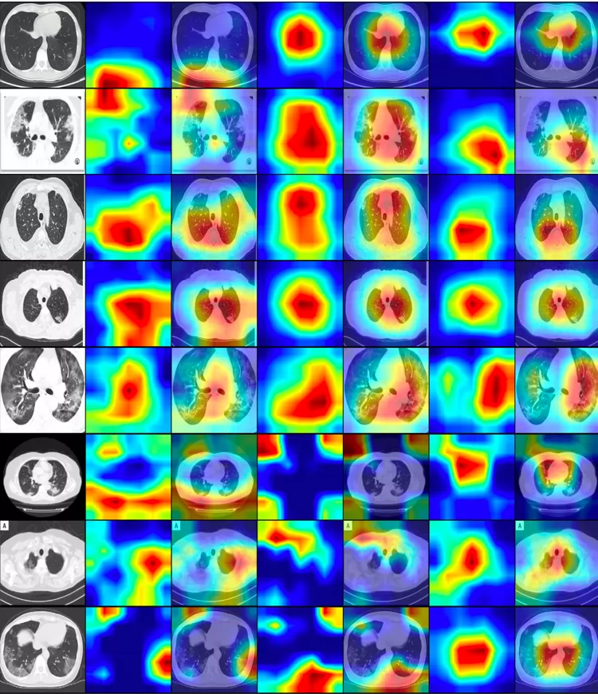
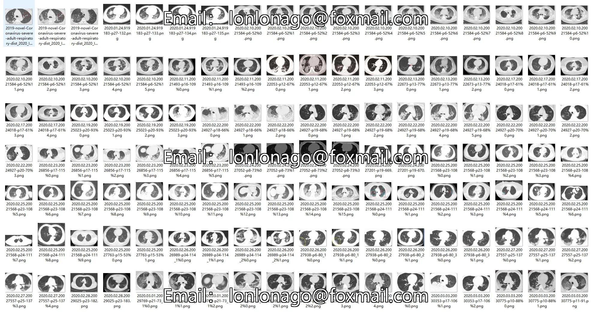
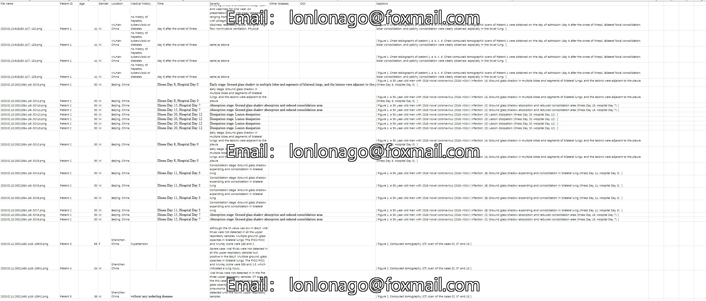
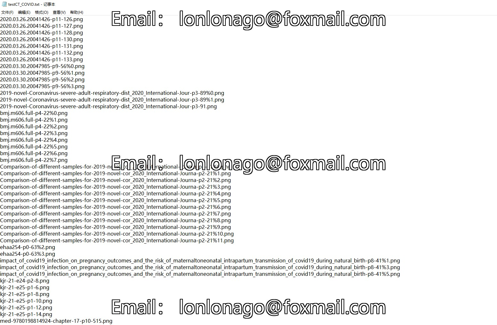
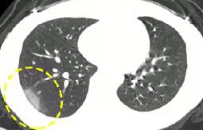
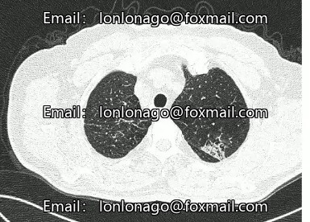
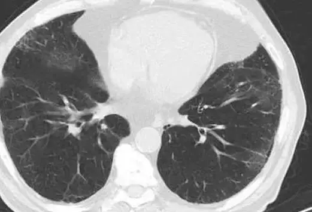

## Body

COVID-19 Dataset: Multimodal Medical Imaging + Text Annotation

Data Size: A total of 746 chest CT slices images + complete text annotation, reviewed by senior radiology doctors from Wuhan Tongji Hospital, authoritative and available.
Data Type:
COVID-19 positive (COVID-19): 349 images from 216 patients, including typical COVID-19 imaging features (ground-glass opacities, paving stones sign, etc.)
Non-COVID negative: 463 images containing other pneumonia, normal chest CT, for binary classification training comparison.
Data Format: Images are PNG/RGB (preprocessed, privacy removed, standardized, no need for additional format conversion); text contains structured labels + semi-structured descriptions, directly adaptable for NLP tasks.

Electronic virtual products sold do not accept returns.

## Images

Here is a pay link on Stripe ( https://buy.stripe.com/3cs8yP7sY87d0vu9AB ). Please contact me lonlonago@foxmail.com after funding $89, and I will send you a complete data files , thank you!

